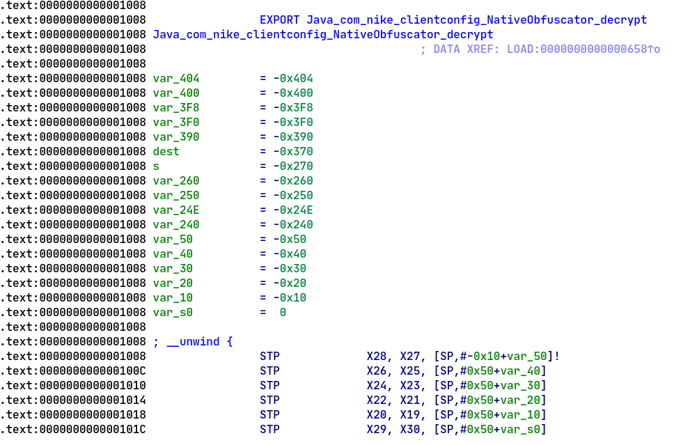

<p align="center" >
<h1>Android Nike Run Club Deobfuscator</h1>
</p>

<p align="center" >

</p>

Small [script](decrypt.py) to decrypt strings obfuscated by ``libnike-obfuscator.so``.

Example:

```text
nrc-darksky-api-key                     : 34fbb986dc1c31609286c27ab31e6953
nrc-events-x-api-authorization-header   : ZjVjZGZiOTgtOWVkMC00MzhlLWI5YzMtZmRkZmUxMTUwMjk1OjhmeGh4dWJkSmdyV3NJRA==
nrc-events-x-api-client-id-header       : 39732344-44e7-4f34-947f-e03b12f1302b
nrc-facebook-shared-client-id           : 733400346807609
nrc-facebook-shared-client-secret       : 04cce2b533ff819d1db828f6c94341b3
nrc-feed-thread-auth                    : bmlrZS1kZXZlbG9wZXI6UncyUmJ0YVR0REVDaWMy
nrc-foursquare-client-id                : SZZRJHU3MCXP4FK2TZKZN5YEQW1R225LPYNL4MAYIZKLOWPK
nrc-foursquare-client-secret            : TX4EMFYKBKSQAWMVURIIRU0GQNCYC04C213ANOX4TCFKMKL3
nrc-gcm-sender                          : 293847022886
nrc-google-wallet-issuer-id             : 3093520844208392502
nrc-imgur-client-id                     : 408c049a489c806
nrc-net-auth-token                      : Basic ZmE2NzJlOTUtYmQwNi00YWZhLWExZjYtYTczNGUzYjhkNmI5OnFidDJ5clJzcUIzbVFTWQ==
nrc-net-client-id                       : acb33287-958b-4d6d-82d7-b624e220324a
nrc-omniture-app-visitor-id             : 6AD9624504BD404EE9092B603A9E1EC8DA32
nrc-omniture-report-suite-id            : nikeplusappprod
nrc-segment-api-key                     : AQzIBimI3XFvsMKXXjFREYpjfS43McGw
nrc-ua-client-id                        : 50qSnrSkSjKBW-di6KtsoA
nrc-ua-client-secret                    : qdrlexwVTHCYSRul8i6wig
nrc-unite-client-id                     : WLr1eIG5JSNNcBJM3npVa6L76MK8OBTt
```

### References:

https://yasoob.me/posts/reverse-engineering-nike-run-club-using-frida-android/

<hr />

[@timmasto](https://twitter.com/timmasto)
